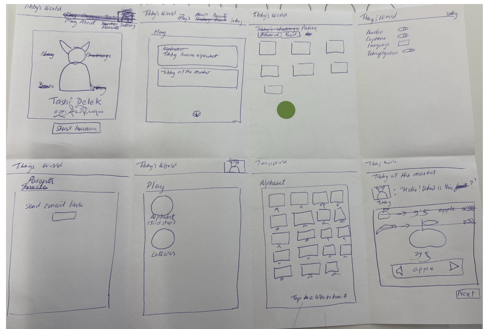
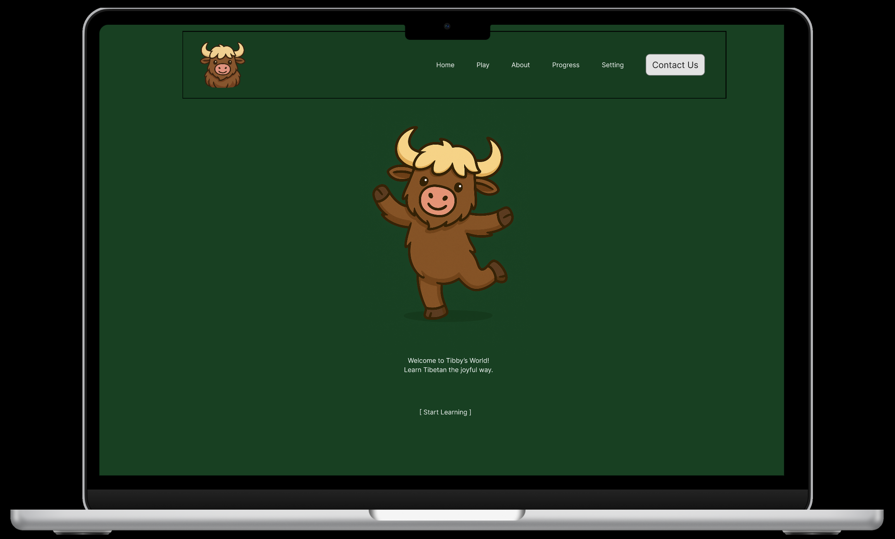

# Projektdokumentation – [Tibboe]

## Inhaltsverzeichnis

1. [Einordnung & Zielsetzung](#1-einordnung--zielsetzung)
2. [Zielgruppe & Stakeholder](#2-zielgruppe--stakeholder)
3. [Anforderungen & Umfang](#3-anforderungen--umfang)
4. [Vorgehen & Artefakte](#4-vorgehen--artefakte)
    - [Understand & Define](#41-understand--define)
    - [Sketch](#42-sketch)
    - [Decide](#43-decide)
    - [Prototype](#44-prototype)
    - [Validate](#45-validate)
5. [Erweiterungen [Optional]](#5-erweiterungen-optional)
6. [Projektorganisation [Optional]](#6-projektorganisation-optional)
7. [KI‑Deklaration](#7-ki‑deklaration)
8. [Anhang [Optional]](#8-anhang-optional)

> **Hinweis:** Massgeblich sind die im **Unterricht** und auf **Moodle** kommunizierten Anforderungen.

<!-- WICHTIG: DIE KAPITELSTRUKTUR DARF NICHT VERÄNDERT WERDEN! -->

<!-- Diese Vorlage ist für eine README.md im Repository gedacht. Abschnitte mit [Optional] können weggelassen werden, wenn in den Übungen nichts anderes verlangt wird. -->

## 1. Einordnung & Zielsetzung
- **Kontext & Problem:** Tibetisch ist für Einsteiger:innen schwer zugänglich. Viele bestehende Angebote sind textlastig, komplex oder nicht auf Anfänger:innen ausgerichtet. Insbesondere fehlen niedrigschwellige, audiovisuelle Lernangebote, die einen spielerischen Einstieg ermöglichen.
- **Ziele:** *Tibboe* ist ein webbasiertes Lernprototyp-Konzept, das den Einstieg in die tibetische Sprache durch Audio, einfache Interaktionen und spielerische Übungen erleichtert. Ziel ist es, erste Buchstaben, Vokale und Wörter verständlich und motivierend zu vermitteln.
- **Abgrenzung:** Der Prototyp fokussiert auf rezeptives Lernen (Hören & Erkennen). Grammatik, Schreiben, Fortschrittstracking oder produktionsreife Backend-Funktionen sind nicht Teil des Projekts.

## 2. Zielgruppe & Stakeholder
- **Primäre Zielgruppe:** 
    - Lernende, die einen ersten Eindruck der Sprache erhalten möchten 
    - Erwachsene ohne Vorkenntnisse der tibetischen Sprache
- **Weitere Stakeholder:**
    - Lehrpersonen oder Kulturvereine 
    - Familien oder Interessierte aus der tibetischen Diaspora 
- **Annahmen:**
    - Audio-gestütztes Lernen erleichtert den Einstieg
    - Kurze, klare Lernsequenzen erhöhen Motivation 
    - Ein spielerischer Challenge-Modus unterstützt das Wiederholen

## 3. Anforderungen & Umfang
- **Kernfunktionalität (Mindestumfang):** 
    - Registrierung, Login und Logout
    - Lernbereiche für Alphabet, Vokale und Wörter
        - Übersicht → Detailansicht → Audio abspielen
    - Challenge-Modus mit Audio und Multiple-Choice-Auswahl
    - Geschützte Inhalte (Challenge nur für eingeloggte Nutzer:innen)
- **Akzeptanzkriterien:** 
    - Alle Inhalte sind ohne Fehlermeldungen zugänglich
    - Audio kann zuverlässig abgespielt werden
    - Challenge kann vollständig durchgeführt werden

## 4. Vorgehen & Artefakte
### 4.1 Understand & Define
- **Ausgangslage & Ziele:** Es besteht ein Mangel an einfachen, audiovisuellen Einstiegsangeboten für Tibetisch-Lernende.
- **Zielgruppenverständnis:**     
    - Einsteiger:innen benötigen klare Struktur und wenig Text
    - Audio ist essenziell für das Verständnis der Sprache 
- **Wesentliche Erkenntnisse:** 
    - Navigation muss selbsterklärend sein
    - Feedback und Fehlermeldungen sind wichtig
    - Kurze Interaktionen sind effektiver als lange Lektionen

### 4.2 Sketch
- **Variantenüberblick:** 
    - Lineare Lernabfolge
    - Grid-basierte Übersichten pro Lernbereich
    - Challenge als separater Spielmodus
- **Skizzen:** 
Es wurden einfache Skizzen (Papier / Low-Fidelity) zur Struktur der Lernbereiche und Navigation erstellt. Sie visualisieren verschiedene Seitenzustände wie Startseite, Lernübersicht, Alphabet-Grid und eine einfache Lernszene mit Audio und Navigation. Der Fokus lag auf einer klaren Struktur, grossen klickbaren Elementen und einer spielerischen Lernabfolge, ohne visuelle Details auszuarbeiten.

### 4.3 Decide
- **Gewählte Variante & Begründung:** Es wurde eine klare, modulare Struktur mit getrennten Lernbereichen (Alphabet, Vokale, Wörter) gewählt. Diese ermöglicht einen schnellen Einstieg und verhindert Überforderung. 
- **End‑to‑End‑Ablauf:** Startseite → Registrierung/Login → Auswahl Lernbereich → Anhören von Inhalten → Üben im Challenge-Modus → Logout
- **Referenz‑Mockup:** Das Referenz-Mockup zeigt die visuelle Richtung des finalen Prototyps. Es dient als Orientierung für Farbstimmung, Figuren-Einsatz (Maskottchen) und Startseiten-Layout. Die reduzierte Navigation, die zentrale Figur und der klare Call-to-Action („Start Learning“) unterstützen einen freundlichen, einladenden Einstieg und wurden als Grundlage für die Umsetzung gewählt. (https://www.figma.com/proto/QqmOoRoi2ev4FRmBW6TrKS/Prototyping?node-id=6-9&t=mPQl5w7Hr1LfUpIx-1&starting-point-node-id=6%3A9) 

### 4.4 Prototype
- **Kernfunktionalität:** Der Prototyp erlaubt das Anhören und Erkennen tibetischer Zeichen und Wörter sowie deren spielerische Wiederholung in einer Challenge.
- **Deployment:** (https://tibboe.netlify.app)

#### 4.4.1. Entwurf (Design)
- **Informationsarchitektur:** Startseite → Login / Registrierung → Lernbereiche → Detailseiten → Challenge → Account / Logout
- **Oberflächenentwürfe:** Grosse klickbare Elemente, reduzierte Texte, klare Audio-Controls und konsistente Navigation.
- **Designentscheidungen:** 
    - Fokus auf Einfachheit
    - Gute Lesbarkeit und klare Hierarchie
    - Spielerischer Charakter statt klassischer Lernplattform

#### 4.4.2. Umsetzung (Technik)
- **Technologie‑Stack:** 
    - SvelteKit
    - MongoDB
    - HTML / CSS / JavaScript
    - Bootstrap
- **Tooling:** 
    - Visual Studio Code
    - Git / GitHub
    - Netlify 
- **Struktur & Komponenten:** 
    - Routenbasierte Seitenstruktur
    - Wiederverwendbare Komponenten für Lernkarten
    - Zentrale Audio-Normalisierung zur Reduktion von Code-Duplikation
- **Besondere Entscheidungen:** 
    - Accessibility-Verbesserungen (korrekte Label-Zuordnung)

### 4.5 Validate
- **URL der getesteten Version** (https://tibboe.netlify.app)
- **Ziele der Prüfung:** Überprüfung der Verständlichkeit und Durchführbarkeit der zentralen Workflows.
- **Vorgehen:** Moderierte Usability-Tests (remote) mit Think-Aloud-Methode.
- **Stichprobe:** 3 Testpersonen ohne Vorkenntnisse der tibetischen Sprache.
- **Aufgaben/Szenarien:** 
    - Account erstellen und einloggen
    - Alphabet-Lernbereich öffnen und Audio abspielen
    - Einen Vokal öffnen und anhören
    - Ein Wort öffnen und anhören
    - Challenge starten und mehrere Aufgaben lösen
- **Kennzahlen & Beobachtungen:** 
    - Alle Aufgaben konnten erfolgreich durchgeführt werden
    - Kleine Unsicherheiten bei Feedback und Orientierung
    - Formularbeschriftungen waren nicht immer eindeutig
- **Zusammenfassung der Resultate:** Die Anwendung wurde als verständlich und motivierend wahrgenommen. Die Kernfunktionalität funktionierte zuverlässig.
- **Abgeleitete Verbesserungen:** 
    - Ergänzung von Empty- und Error-States
    - Verbesserung der Accessibility in Formularen
    - Vereinheitlichung der Audio-Logik

## 5. Erweiterungen

**Beschreibung & Nutzen:**  
- **Benutzerkonto & geschützte Inhalte:**  
  Registrierung, Login und Logout sowie eine geschützte Challenge-Seite, die nur für eingeloggte Nutzer:innen zugänglich ist.  
  *Nutzen:* Ermöglicht eine personalisierte Nutzung und verhindert den Zugriff auf Lernspiele ohne Account.

- **Robustheit der Audio-Inhalte:**  
  Vereinheitlichung und Normalisierung der Audio-Pfade, sodass Inhalte auch bei uneinheitlichen Dateinamen oder Ordnerstrukturen zuverlässig abgespielt werden können.  
  *Nutzen:* Stabilere Lernexperience und weniger Fehler bei der Audio-Wiedergabe.

- **Usability- und Accessibility-Verbesserungen:**  
  Korrekte Zuordnung von Formular-Labels sowie die Einführung von Empty- und Error-States bei fehlenden Inhalten.  
  *Nutzen:* Bessere Verständlichkeit, höhere Zugänglichkeit und weniger Frustration für Nutzende.

**Umsetzung in Kürze:**  
- **Authentifizierung:** Cookie-basierte Session-Verwaltung mit `hooks.server.js` und MongoDB-gestützter User-Verwaltung inkl. Passwort-Hashing.  
- **Protected Routes:** Automatischer Redirect auf `/login`, wenn geschützte Inhalte ohne gültige Session aufgerufen werden.  
- **Audio-Handling:** Zentrale Vereinheitlichung von Audio-Pfaden (z. B. Korrektur von `/words/` zu `/word/`).  
- **UI/A11y:** Anpassung der Formularstruktur (Labels mit `for/id`) sowie verständliche Hinweise bei leeren oder fehlerhaften Zuständen.

**Abgrenzung zum Mindestumfang:**  
Der Mindestumfang fordert durchgängige Kern-Workflows. Die genannten Erweiterungen erhöhen gezielt Stabilität, Bedienbarkeit und Robustheit des Prototyps (Qualitätsverbesserungen), ohne zusätzliche komplexe Funktionen einzuführen oder den Mindestumfang zu gefährden.

## 6. Projektorganisation
**Repository & Struktur:**  
- `src/routes/` – Seiten & Workflows (Login, Register, Learn, Challenge, Settings)  
- `src/lib/` – Datenzugriff & Hilfslogik (MongoDB, Audio-Handling, Komponenten)  
- `static/` – Assets (Audio-Dateien, Bilder)  
- `README.md` – Projektdokumentation inkl. Validate & KI-Deklaration  

**Issue-Management:**  
Während der Entwicklung wurden Aufgaben und Verbesserungen iterativ umgesetzt. Die Planung erfolgte entlang der Projektphasen (Implementierung, Usability-Verbesserungen, Dokumentation). Kleinere Anpassungen und Bugfixes wurden direkt im Entwicklungsprozess vorgenommen.

**Commit-Praxis:**  
Commits wurden regelmässig erstellt und beschreiben die jeweils umgesetzten Änderungen. Beispiele:  
- `first commit`  
- `update learn page`  

## 7. KI‑Deklaration
### Eingesetzte KI‑Werkzeuge
- ChatGPT (OpenAI)

### Zweck & Umfang
- KI wurde zur Unterstützung bei Refactoring, Debugging, Accessibility-Verbesserungen sowie bei der sprachlichen und strukturellen Ausarbeitung der Projektdokumentation eingesetzt. Die Vorschläge wurden kritisch geprüft und bei Bedarf angepasst.

### Art der Beiträge
- Code-Vorschläge und Verbesserungen
- Hilfe bei Fehleranalyse
- Textentwürfe für Dokumentation

### Eigene Leistung (Abgrenzung)
- Konzept, Design, Implementierung, Usability-Tests und finale Entscheidungen wurden eigenständig umgesetzt.

### Reflexion
- KI beschleunigte den Entwicklungsprozess, erforderte jedoch stets kritische Überprüfung und Anpassung.

### Prompt‑Vorgehen [Optional]
_[wichtige Prompts/Workflows in Kürze]_

### Quellen & Rechte [Optional]
_[verwendete Vorlagen/Assets/Modelle; Lizenz/Urheberrecht; Zitierweise]_

## 8. Anhang [Optional]
Beispiele:
- **Testskript & Materialien:** _[Link/Datei]_  
- **Rohdaten/Auswertung:** _[Link/Datei]_  

---

<!-- Prüfliste (nicht abgeben, nur intern nutzen) -->
<!--
[ ] Kernfunktionalität gemäss Übungen umgesetzt (Workflows durchgängig)
[ ] Akzeptanzkriterien formuliert und erfüllt
[ ] Skizzen erstellt (mehrere Varianten, Unterschiede dokumentiert)
[ ] Referenz‑Mockup in Decide verlinkt (URL/Screenshots)
[ ] Deployment erreichbar
[ ] Umsetzung (Technik) vollständig (Technologie‑Stack; Tooling & KI‑Einsatz inkl. Überlegungen; Struktur/Komponenten; Daten/Schnittstellen falls genutzt)
[ ] Evaluation durchgeführt; Ergebnisse dokumentiert; Verbesserungen abgeleitet
[ ] Dokumentation vollständig, klar strukturiert und konsistent
[ ] KI‑Deklaration ausgefüllt (Werkzeuge; Zweck & Umfang; Art der Beiträge; Abgrenzung; Quellen & Rechte; optional: Prompt‑Vorgehen, Reflexion)
[ ] Erweiterungen (falls vorhanden) begründet und abgegrenzt
[ ] Anhang gepflegt (Testskript/Materialien, Rohdaten/Auswertung) [optional]
-->